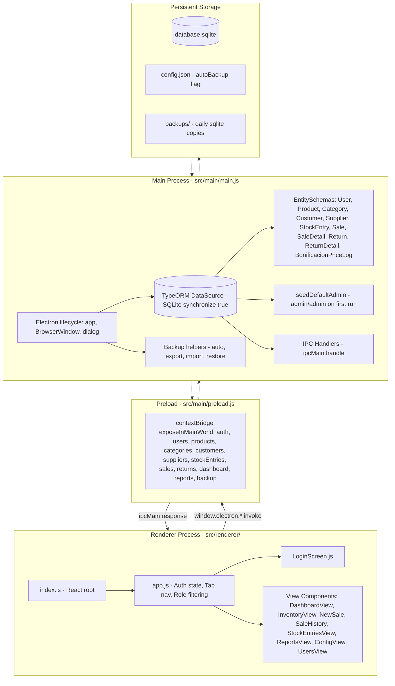
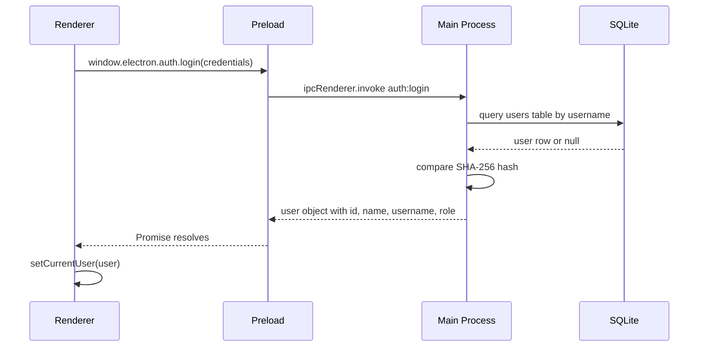
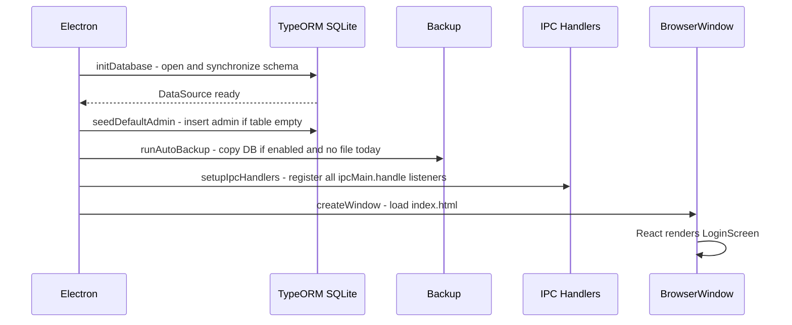

# ARCHITECTURE — System Architecture Diagram

## Three-layer Electron architecture

```mermaid
graph TB
    subgraph RENDERER["Renderer Process - src/renderer/"]
        IDX[index.js - React root]
        APP[app.js - Auth state, Tab nav, Role filtering]
        LOGIN[LoginScreen.js]
        VIEWS[View Components: DashboardView, InventoryView, NewSale, SaleHistory, StockEntriesView, ReportsView, ConfigView, UsersView]
        IDX --> APP
        APP --> LOGIN
        APP --> VIEWS
    end

    subgraph PRELOAD["Preload - src/main/preload.js"]
        BRIDGE[contextBridge exposeInMainWorld: auth, users, products, categories, customers, suppliers, stockEntries, sales, returns, dashboard, reports, backup]
    end

    subgraph MAIN["Main Process - src/main/main.js"]
        ELECTRON[Electron lifecycle: app, BrowserWindow, dialog]
        SCHEMAS[EntitySchemas: User, Product, Category, Customer, Supplier, StockEntry, Sale, SaleDetail, Return, ReturnDetail, BonificacionPriceLog]
        DS[(TypeORM DataSource - SQLite synchronize true)]
        IPC[IPC Handlers - ipcMain.handle]
        SEED[seedDefaultAdmin - admin/admin on first run]
        BACKUP[Backup helpers - auto, export, import, restore]
        ELECTRON --> DS
        DS --> SCHEMAS
        DS --> SEED
        DS --> IPC
        ELECTRON --> BACKUP
    end

    subgraph STORAGE["Persistent Storage"]
        DB[(database.sqlite)]
        CFG[config.json - autoBackup flag]
        BKPS[backups/ - daily sqlite copies]
    end

    RENDERER -- "window.electron.* invoke" --> PRELOAD
    PRELOAD -- "ipcMain response" --> RENDERER
    PRELOAD --> MAIN
    MAIN --> PRELOAD
    MAIN --> STORAGE
    STORAGE --> MAIN
```

## IPC call lifecycle

```mermaid
sequenceDiagram
    participant R as Renderer
    participant P as Preload
    participant M as Main Process
    participant DB as SQLite

    R->>P: window.electron.auth.login(credentials)
    P->>M: ipcRenderer.invoke auth:login
    M->>DB: query users table by username
    DB-->>M: user row or null
    M->>M: compare SHA-256 hash
    M-->>P: user object with id, name, username, role
    P-->>R: Promise resolves
    R->>R: setCurrentUser(user)
```

## Startup sequence

```mermaid
sequenceDiagram
    participant E as Electron
    participant DB as TypeORM SQLite
    participant B as Backup
    participant IPC as IPC Handlers
    participant W as BrowserWindow

    E->>DB: initDatabase - open and synchronize schema
    DB-->>E: DataSource ready
    E->>DB: seedDefaultAdmin - insert admin if table empty
    E->>B: runAutoBackup - copy DB if enabled and no file today
    E->>IPC: setupIpcHandlers - register all ipcMain.handle listeners
    E->>W: createWindow - load index.html
    W->>W: React renders LoginScreen
```
