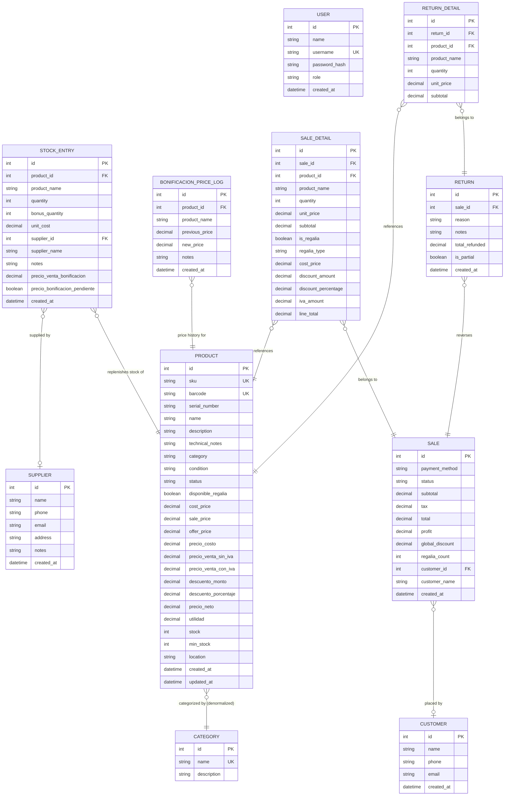

# ERD — Entity Relationship Diagram

All tables defined in `src/main/main.js` as TypeORM `EntitySchema` objects.
Relationships are logical (not ORM-enforced FK constraints — SQLite with `synchronize: true`).

## Notes

- `USER` has no FK to other tables — it is used only for authentication
- `PRODUCT.category` stores the category **name** (denormalized string), not an FK to `CATEGORY.id`
- `STOCK_ENTRY.supplier_name` and `SALE.customer_name` are **snapshots** taken at creation time
- `SALE_DETAIL` fields (`cost_price`, `unit_price`, `discount_*`, `iva_amount`, `line_total`) are **immutable snapshots** — historical reports always read stored values
- Legacy columns (`cost_price`, `sale_price`/`price`, `offer_price`) on `PRODUCT` are kept in sync with the `precio_*` fields for backward compatibility
