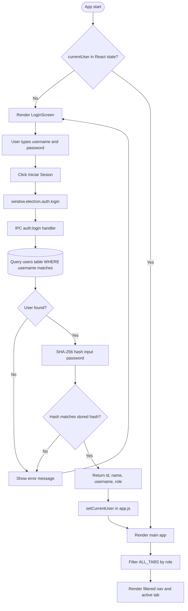
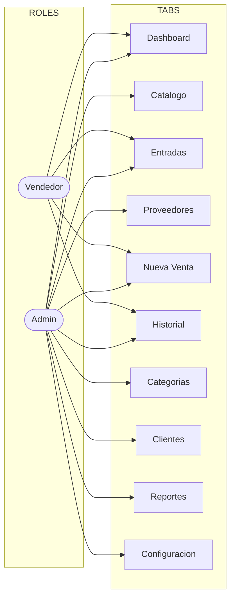
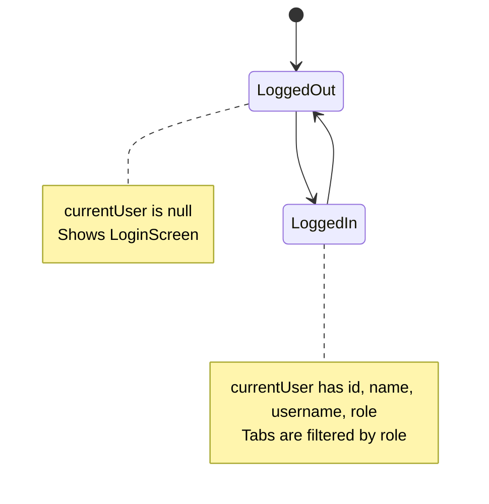

# FLOW-LOGIN — Login and Role-Based Access

## Login flow

```mermaid
flowchart TD
    A([App start]) --> B{currentUser in React state?}
    B -- No --> C[Render LoginScreen]
    B -- Yes --> MAIN[Render main app]

    C --> D[User types username and password]
    D --> E[Click Iniciar Sesion]
    E --> F[window.electron.auth.login]
    F --> G[IPC auth:login handler]

    G --> H[(Query users table WHERE username matches)]
    H --> I{User found?}
    I -- No --> ERR1[Show error message]
    ERR1 --> C

    I -- Yes --> J[SHA-256 hash input password]
    J --> K{Hash matches stored hash?}
    K -- No --> ERR1
    K -- Yes --> L[Return id, name, username, role]

    L --> M[setCurrentUser in app.js]
    M --> MAIN

    MAIN --> N[Filter ALL_TABS by role]
    N --> O[Render filtered nav and active tab]
```

## Role-based tab access

```mermaid
flowchart LR
    subgraph ROLES
        A([Admin])
        V([Vendedor])
    end

    subgraph TABS
        T1[Dashboard]
        T2[Catalogo]
        T3[Entradas]
        T4[Proveedores]
        T5[Nueva Venta]
        T6[Historial]
        T7[Categorias]
        T8[Clientes]
        T9[Reportes]
        T10[Configuracion]
    end

    A --> T1
    A --> T2
    A --> T3
    A --> T4
    A --> T5
    A --> T6
    A --> T7
    A --> T8
    A --> T9
    A --> T10

    V --> T1
    V --> T3
    V --> T5
    V --> T6
```

## Session lifecycle

```mermaid
stateDiagram-v2
    [*] --> LoggedOut
    LoggedOut --> LoggedIn
    LoggedIn --> LoggedOut

    note right of LoggedOut
        currentUser is null
        Shows LoginScreen
    end note

    note right of LoggedIn
        currentUser has id, name, username, role
        Tabs are filtered by role
    end note
```
