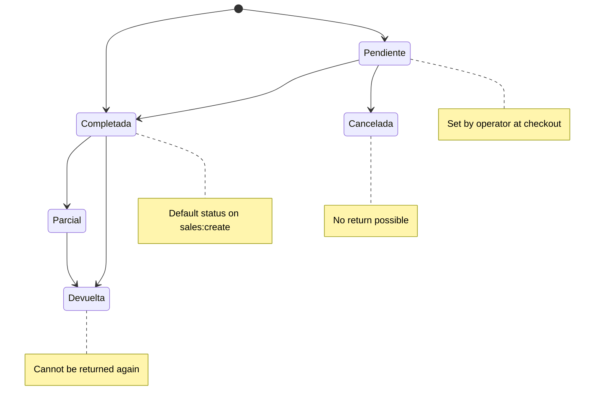

# FLOW-RETURN — Return / Devolution Flow

## Full return flow

```mermaid
flowchart TD
    START([User logged in]) --> NAV[Navigate to Historial tab]
    NAV --> LOAD[Load sales and returns via IPC getAll]

    LOAD --> TABLE[Sales table with status badges]
    TABLE --> FIND[Find target sale]

    FIND --> ELIGIBLE{Sale status?}
    ELIGIBLE -- Completada --> CANRETURN
    ELIGIBLE -- Parcial --> CANRETURN
    ELIGIBLE -- Pendiente or Devuelta or Cancelada --> BLOCKED[Devolver button hidden or disabled]

    CANRETURN[Click Devolver] --> MODAL[Open ReturnModal]

    MODAL --> ITEMS[Show sale items with original quantities]
    ITEMS --> ALREADY[Compute alreadyReturned from prior returns for this sale]
    ALREADY --> AVAIL[Show available qty per item. Fully returned items are disabled]

    AVAIL --> SELECT[User selects items and quantities]
    SELECT --> REASON[Select reason: Producto defectuoso, Error en venta, Cliente arrepentido, Otro]
    REASON --> NOTES[Optional notes]
    NOTES --> CONFIRM[Click Confirmar Devolucion]

    CONFIRM --> IPC[IPC: returns:create]

    IPC --> SVAL[Load all prior returns for this sale_id]
    SVAL --> QVAL{Each qty requested is within available?}
    QVAL -- No --> ERRQTY[Throw error: cantidad excede lo disponible]
    ERRQTY --> MODAL

    QVAL -- Yes --> TX[(DB Transaction)]
    TX --> SAVERETURN[(INSERT Return)]
    SAVERETURN --> SAVEDETAILS[(INSERT ReturnDetail per item)]
    SAVEDETAILS --> RESTORESTOCK[(UPDATE product.stock += qty per item)]
    RESTORESTOCK --> UPDSTATUS[(UPDATE Sale.status)]

    UPDSTATUS --> CHECKFULL{All items fully returned?}
    CHECKFULL -- Yes --> SETDEV[status = Devuelta]
    CHECKFULL -- No --> SETPAR[status = Parcial]

    SETDEV --> COMMIT[Commit transaction]
    SETPAR --> COMMIT
    COMMIT --> REFRESH[Reload sales and returns in UI]
```

## Sale status state machine

```mermaid
stateDiagram-v2
    [*] --> Completada
    [*] --> Pendiente
    Completada --> Parcial
    Completada --> Devuelta
    Parcial --> Devuelta
    Pendiente --> Completada
    Pendiente --> Cancelada

    note right of Completada
        Default status on sales:create
    end note

    note right of Pendiente
        Set by operator at checkout
    end note

    note right of Devuelta
        Cannot be returned again
    end note

    note right of Cancelada
        No return possible
    end note
```
