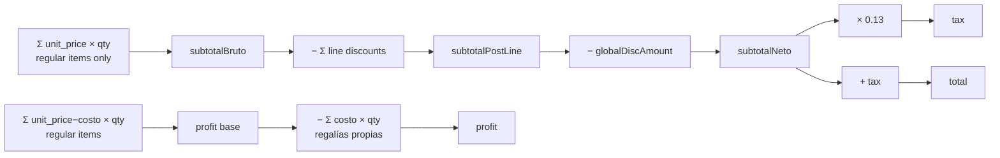
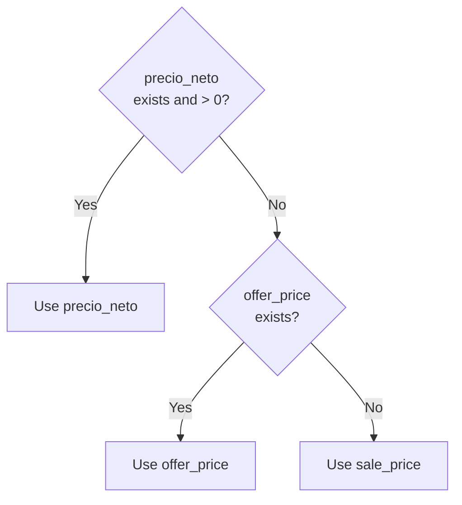

# FLOW-SALE — Complete Sale Flow

## High-level flow

```mermaid
flowchart TD
    START([User logged in]) --> NAV[Navigate to Nueva Venta tab]
    NAV --> LOAD[Load products + customers\nvia IPC getAll]

    LOAD --> SEARCH{Find product}
    SEARCH -- Barcode scan --> SCAN[Enter barcode → Enter key\n2 sec feedback highlight]
    SEARCH -- Text search --> TXT[Type name/category\nfiltered list updates]

    SCAN --> FOUND{Product found?}
    TXT --> FOUND
    FOUND -- No --> ERR1[Show 'Producto no encontrado']
    ERR1 --> SEARCH

    FOUND -- Yes, stock > 0 --> ADDOPT{Add option}
    ADDOPT -- Normal --> CART[Add to cart at precio_neto]
    ADDOPT -- Regalía\nif disponible_regalia=true --> GIFT[Add to cart at $0.00\nwith REGALÍA badge]

    CART --> CARTVIEW[Cart panel]
    GIFT --> CARTVIEW

    CARTVIEW --> ADJUST[Adjust quantity +/−\nor remove item]
    ADJUST --> DISC{Apply discount?}
    DISC -- Per-line --> LINEDISC[Enter $ or % per item]
    DISC -- Global --> GLOBDISC[Enter $ or % over subtotal]
    DISC -- None --> TOTALS

    LINEDISC --> TOTALS[Compute totals\nsubtotal · IVA 13% · total]
    GLOBDISC --> TOTALS

    TOTALS --> CUSTOMER[Optional: select/search customer]
    CUSTOMER --> PMETHOD[Select payment method\nEfectivo / Tarjeta / Transferencia]
    PMETHOD --> STATUS[Select status\nCompletada / Pendiente]
    STATUS --> CONFIRM[Click Confirmar Venta]

    CONFIRM --> IPC[IPC: sales:create\nitems · customerId · paymentMethod · status · globalDiscount]

    IPC --> TX[(DB Transaction)]
    TX --> VAL{All product_ids\nexist in DB?}
    VAL -- No --> ERRPROD[throw 'Producto no encontrado']
    ERRPROD --> CONFIRM

    VAL -- Yes --> CALC[Compute subtotal · tax · total · profit]
    CALC --> SAVESALE[(INSERT Sale)]
    SAVESALE --> SAVEDETAILS[(INSERT SaleDetail × N\nwith immutable snapshots)]
    SAVEDETAILS --> DECSTOCK[(UPDATE product.stock\n−= qty for each item\nincluding regalías)]
    DECSTOCK --> COMMIT[Commit transaction]

    COMMIT --> RECEIPT[Show SaleReceipt modal\nfrosted glass overlay]
    RECEIPT --> PRINTOPT{Print?}
    PRINTOPT -- Yes --> PRINT[window.print\n@media print hides all except receipt]
    PRINTOPT -- No / Close --> DONE[Navigate to Historial]
    PRINT --> DONE
```

## Cart total computation



## Pricing priority in cart (per product)


