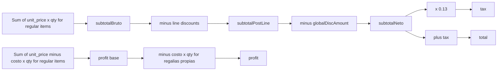
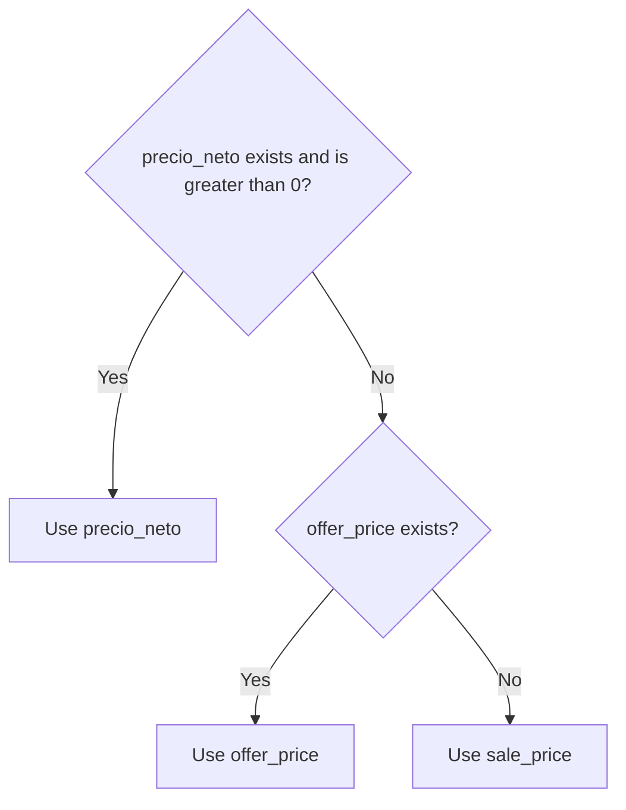

# FLOW-SALE — Complete Sale Flow

## High-level flow

```mermaid
flowchart TD
    START([User logged in]) --> NAV[Navigate to Nueva Venta tab]
    NAV --> LOAD[Load products and customers via IPC getAll]

    LOAD --> SEARCH{Find product}
    SEARCH -- Barcode scan --> SCAN[Enter barcode and press Enter]
    SEARCH -- Text search --> TXT[Type name or category to filter list]

    SCAN --> FOUND{Product found?}
    TXT --> FOUND
    FOUND -- No --> ERR1[Show Producto no encontrado]
    ERR1 --> SEARCH

    FOUND -- Yes, stock > 0 --> ADDOPT{Add option}
    ADDOPT -- Normal --> CART[Add to cart at precio_neto]
    ADDOPT -- Regalia if disponible_regalia is true --> GIFT[Add to cart at $0.00 with REGALIA badge]

    CART --> CARTVIEW[Cart panel]
    GIFT --> CARTVIEW

    CARTVIEW --> ADJUST[Adjust quantity or remove item]
    ADJUST --> DISC{Apply discount?}
    DISC -- Per-line --> LINEDISC[Enter amount or percent per item]
    DISC -- Global --> GLOBDISC[Enter amount or percent over subtotal]
    DISC -- None --> TOTALS

    LINEDISC --> TOTALS[Compute: subtotal, IVA 13%, total]
    GLOBDISC --> TOTALS

    TOTALS --> CUSTOMER[Optional: select or search customer]
    CUSTOMER --> PMETHOD[Select payment method: Efectivo, Tarjeta, Transferencia]
    PMETHOD --> STATUS[Select status: Completada or Pendiente]
    STATUS --> CONFIRM[Click Confirmar Venta]

    CONFIRM --> IPC[IPC: sales:create]

    IPC --> TX[(DB Transaction)]
    TX --> VAL{All product_ids exist in DB?}
    VAL -- No --> ERRPROD[Throw: Producto no encontrado]
    ERRPROD --> CONFIRM

    VAL -- Yes --> CALC[Compute subtotal, tax, total, profit]
    CALC --> SAVESALE[(INSERT Sale)]
    SAVESALE --> SAVEDETAILS[(INSERT SaleDetail per item with immutable snapshots)]
    SAVEDETAILS --> DECSTOCK[(UPDATE product.stock minus qty per item including regalias)]
    DECSTOCK --> COMMIT[Commit transaction]

    COMMIT --> RECEIPT[Show SaleReceipt modal]
    RECEIPT --> PRINTOPT{Print?}
    PRINTOPT -- Yes --> PRINT[window.print - media print hides all except receipt]
    PRINTOPT -- No or Close --> DONE[Navigate to Historial]
    PRINT --> DONE
```

## Cart total computation

```mermaid
flowchart LR
    A[Sum of unit_price x qty for regular items] --> B[subtotalBruto]
    B --> C[minus line discounts] --> D[subtotalPostLine]
    D --> E[minus globalDiscAmount] --> F[subtotalNeto]
    F --> G[x 0.13] --> H[tax]
    F --> I[plus tax] --> J[total]

    K[Sum of unit_price minus costo x qty for regular items] --> L[profit base]
    L --> M[minus costo x qty for regalias propias] --> N[profit]
```

## Pricing priority in cart (per product)

```mermaid
flowchart TD
    P1{precio_neto exists and is greater than 0?}
    P1 -- Yes --> USE1[Use precio_neto]
    P1 -- No --> P2{offer_price exists?}
    P2 -- Yes --> USE2[Use offer_price]
    P2 -- No --> USE3[Use sale_price]
```
