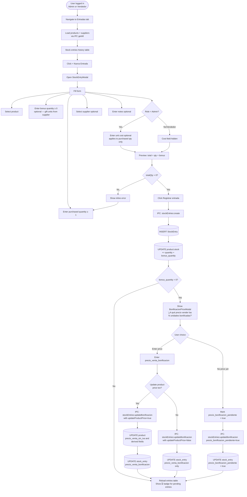
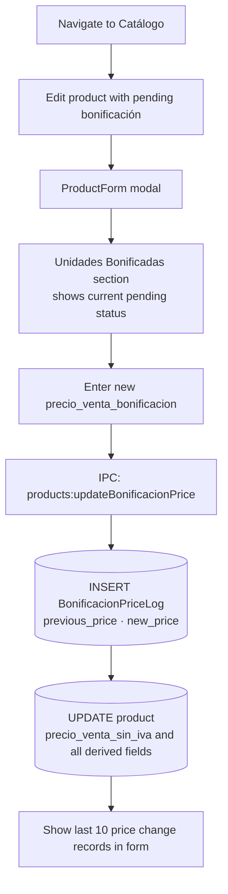
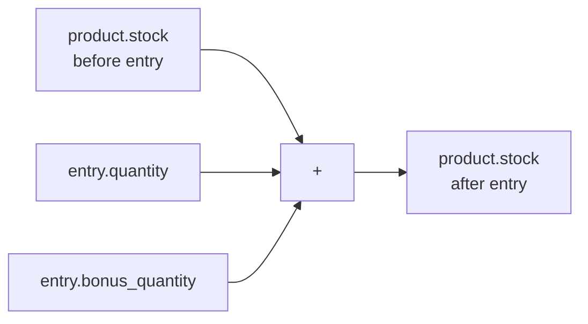

# FLOW-STOCK — Stock Entry Flow (with Bonificación)

## Full stock entry flow

```mermaid
flowchart TD
    START([User logged in\nAdmin or Vendedor]) --> NAV[Navigate to Entradas tab]
    NAV --> LOAD[Load products + suppliers\nvia IPC getAll]

    LOAD --> TABLE[Stock entries history table]
    TABLE --> NEW[Click + Nueva Entrada]
    NEW --> MODAL[Open StockEntryModal]

    MODAL --> FORM[Fill form]
    FORM --> PROD[Select product]
    FORM --> QTY[Enter purchased quantity ≥ 1]
    FORM --> BONUS[Enter bonus quantity ≥ 0\noptional — gift units from supplier]
    FORM --> COST{Role = Admin?}
    COST -- Yes --> COSTFIELD[Enter unit cost optional\napplies to purchased qty only]
    COST -- No/Vendedor --> NOCOST[Cost field hidden]

    COSTFIELD --> TOTALPREVIEW[Preview: total = qty + bonus]
    NOCOST --> TOTALPREVIEW

    FORM --> SUP[Select supplier optional]
    FORM --> NOTES[Enter notes optional]

    TOTALPREVIEW --> VAL{totalQty > 0?}
    VAL -- No --> ERRQTY[Show inline error]
    ERRQTY --> QTY

    VAL -- Yes --> SUBMIT[Click Registrar entrada]
    SUBMIT --> IPC[IPC: stockEntries:create]

    IPC --> SAVEENTRY[(INSERT StockEntry)]
    SAVEENTRY --> INCSTOCK[(UPDATE product.stock\n+= quantity + bonus_quantity)]
    INCSTOCK --> CHECKBONUS{bonus_quantity > 0?}

    CHECKBONUS -- No --> DONE[Reload entries list]
    CHECKBONUS -- Yes --> BONUSMODAL[Show BonificacionPriceModal\n'¿A qué precio vender las N unidades bonificadas?']

    BONUSMODAL --> PRICEOPT{User choice}
    PRICEOPT -- Enter price --> SETPRICE[Enter precio_venta_bonificacion]
    PRICEOPT -- No price yet --> PENDING[Mark precio_bonificacion_pendiente = true]

    SETPRICE --> UPDATEPROD{Update product\nprice too?}
    UPDATEPROD -- Yes --> IPCUPD[IPC: stockEntries:updateBonificacion\nwith updateProductPrice=true]
    IPCUPD --> UPDATEDBPROD[(UPDATE product\nprecio_venta_sin_iva and derived fields)]
    UPDATEDBPROD --> UPDATEENTRY[(UPDATE stock_entry\nprecio_venta_bonificacion)]
    UPDATEENTRY --> DONE

    UPDATEPROD -- No --> IPCUPD2[IPC: stockEntries:updateBonificacion\nwith updateProductPrice=false]
    IPCUPD2 --> UPDATEENTRY2[(UPDATE stock_entry\nprecio_venta_bonificacion only)]
    UPDATEENTRY2 --> DONE

    PENDING --> IPCPEND[IPC: stockEntries:updateBonificacion\nprecio_bonificacion_pendiente=true]
    IPCPEND --> MARKENTRY[(UPDATE stock_entry\nprecio_bonificacion_pendiente = true)]
    MARKENTRY --> DONE

    DONE[Reload entries table\nShow ⏳ badge for pending entries]
```

## Alternative: set bonification price later via ProductForm

```mermaid
flowchart TD
    NAV2[Navigate to Catálogo] --> EDIT[Edit product with pending bonificación]
    EDIT --> PFFORM[ProductForm modal]
    PFFORM --> BONUSSEC[Unidades Bonificadas section\nshows current pending status]
    BONUSSEC --> SETPRICE2[Enter new precio_venta_bonificacion]
    SETPRICE2 --> IPC2[IPC: products:updateBonificacionPrice]
    IPC2 --> LOG[(INSERT BonificacionPriceLog\nprevious_price · new_price)]
    LOG --> UPDPROD2[(UPDATE product\nprecio_venta_sin_iva and all derived fields)]
    UPDPROD2 --> HISTORY[Show last 10 price change records in form]
```

## Stock formula

```mermaid
flowchart LR
    PREV[product.stock\nbefore entry] --> PLUS[+]
    QTY[entry.quantity] --> PLUS
    BONUS[entry.bonus_quantity] --> PLUS
    PLUS --> NEXT[product.stock\nafter entry]
```
