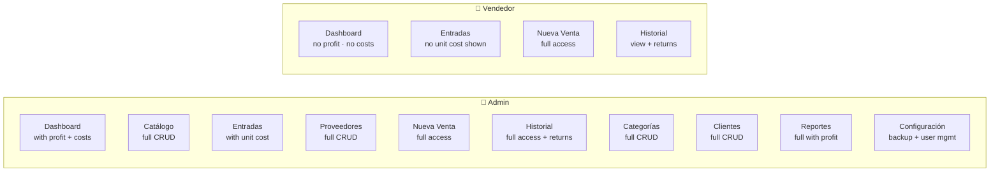
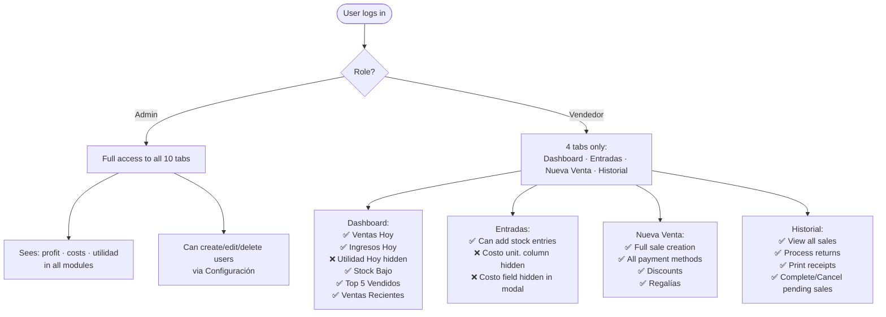
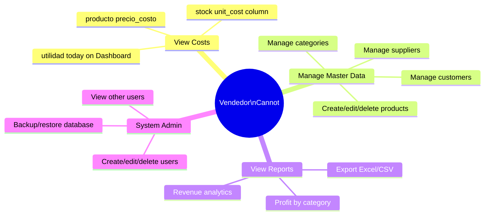

# ROLES — Admin vs Vendedor Permissions

## Module access by role



## Permission matrix

```mermaid
%%{init: {'theme': 'base', 'themeVariables': {'primaryColor': '#e3f2fd'}}}%%
quadrantChart
    title Module Access (Admin vs Vendedor)
    x-axis Low Sensitivity --> High Sensitivity
    y-axis Vendedor Only --> Both Roles
    quadrant-1 Admin Only
    quadrant-2 Both with restrictions
    quadrant-3 Vendedor (limited)
    quadrant-4 Admin Only (sensitive)
    Nueva Venta: [0.15, 0.85]
    Historial: [0.25, 0.80]
    Dashboard básico: [0.2, 0.65]
    Entradas sin costo: [0.3, 0.60]
    Dashboard con utilidad: [0.75, 0.55]
    Reportes: [0.8, 0.25]
    Configuración: [0.7, 0.20]
    Catálogo CRUD: [0.6, 0.30]
    Gestión Usuarios: [0.9, 0.15]
```

## Detailed restrictions



## What Vendedor CANNOT do


