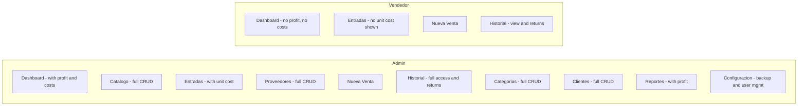
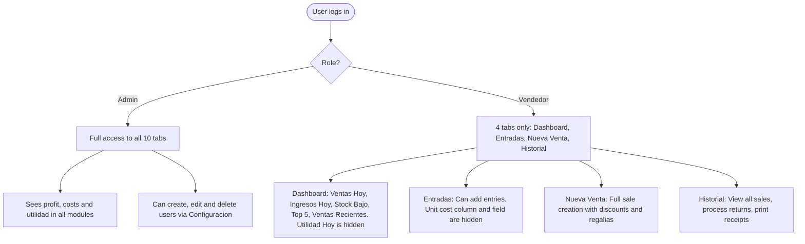
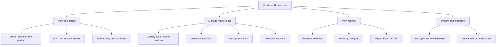

# ROLES — Admin vs Vendedor Permissions

## Module access by role

## Permission matrix

| Module | Admin | Vendedor |
|---|---|---|
| Dashboard | Full — ventas, ingresos, utilidad, stock, top 5 | Partial — ventas e ingresos only, no profit |
| Catalogo | Full CRUD | No access |
| Entradas | Full — with unit cost | Add only — cost fields hidden |
| Proveedores | Full CRUD | No access |
| Nueva Venta | Full | Full |
| Historial | Full — view, returns, complete/cancel | Full — view, returns, complete/cancel |
| Categorias | Full CRUD | No access |
| Clientes | Full CRUD | No access |
| Reportes | Full — with profit and exports | No access |
| Configuracion | Full — backup and user management | No access |

## Detailed restrictions

## What Vendedor cannot do

